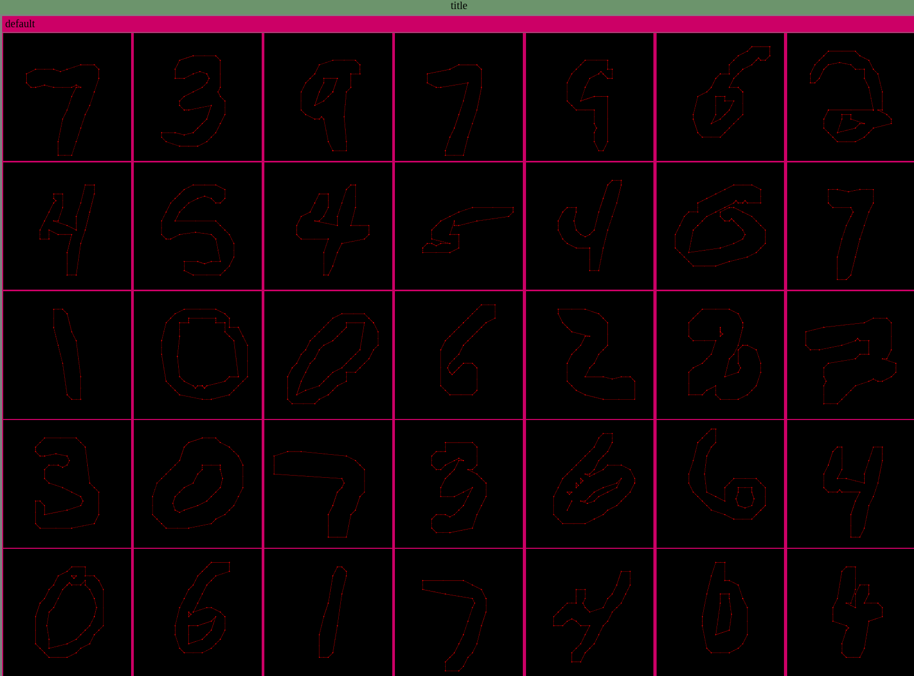
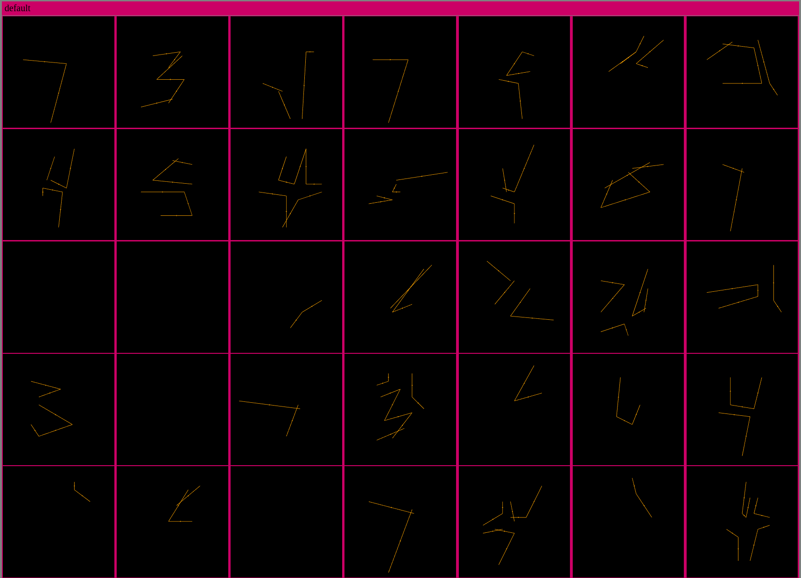

# VISION: A PROGRAMMING APPROACH

## Existing Approaches to Vision

### Traditional feature-based approaches

Handcrafted feature descriptors such as SIFT and SURF are fed to traditional
machine learning classification algorithms such as Support Vector Machines and k-Nearest Neighbours to solve the aforementioned CV problems.

Biggest problem: doesn't work well for large datasets.

### End-to-end approaches

Deep learning.

Biggest problem: doesn't explain well, totally not scientific.

## A New Programming-Based Approach

Here we present a new programming-based approach, which can generate models that are truly interpretable and efficient.

Let's first see what the model is like in the case of Mnist.

### The Model for Mnist

We define the following features:

- `raw_input`: this is the raw input of mnist dataset, $28\times 28$ gray scale image;

- `binary_image`: a binary image obtained from thresholding `raw_input`.

- `connected_components`: the set of connected components of `binary_image`.

- `major_connected_component`: a single connected region obtained from connected_components so that:

  - equals `connected_components[0]` when there is only one connected components

  - when there are two very close connected components, say, $A$ and $B$, is the union of $A$ and $B$ together with all paths from $A$ to $B$ of lengths no more than $dist(A, B) + \epsilon$ where $\epsilon$ is very small.

  - otherwise, equals the largest one

- `major_raw_contours`: the set of contours of `major_connected_component` represented by `Vec<Vec<Point2d>>`. The convention is that `major_raw_contours[0]` is always the counterclosewise (also the outer) one.

- `major_line_segment_sketch`: line segment sketch of `major_raw_contours[0]`. This sketching is roughly speaking, very similar to that in painting. This is key to our interpretable and efficient processing of shapes. It's quite natural, as this technique has been developed in painting for thousands of years.

- `major_concave_components`

